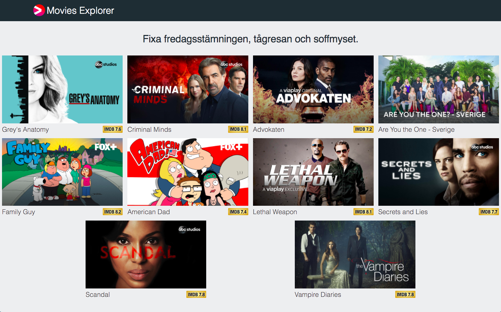

# Movies Explorer

This web app is displaying movies from Web API in a grid. It's build using ReactJs, ReduxJs & CSS.

This app is created using [create-react-app](https://github.com/facebook/create-react-app) but nothing of the script codes/boilerplates are used, I only used is to do the configuration part for me.

This app is packed using [react-scripts](https://www.npmjs.com/package/react-scripts) which is depending on webpack.

## How to run

- Clone the repository to your local machine `$ git clone https://github.com/AnasFullStack/Movies-Explorer.git`
- Change directory to the app
- run `$ npm install`
- To run it locally in the development environment `$ npm start`
- To build it run `$ npm run build` then upload the created **build** folder to a webserver and use it.
